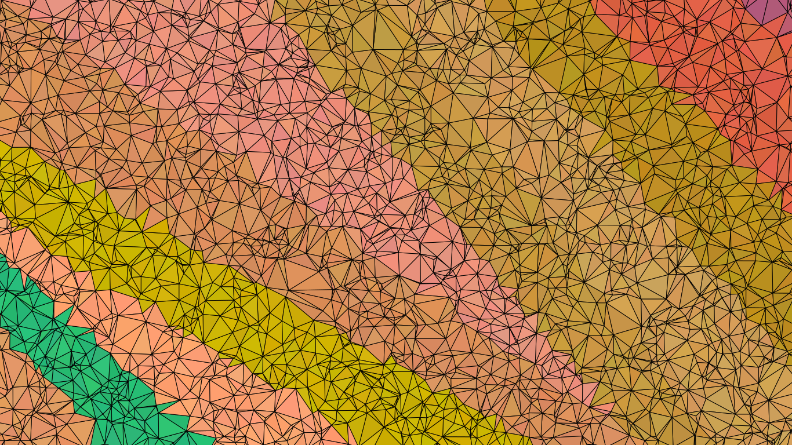
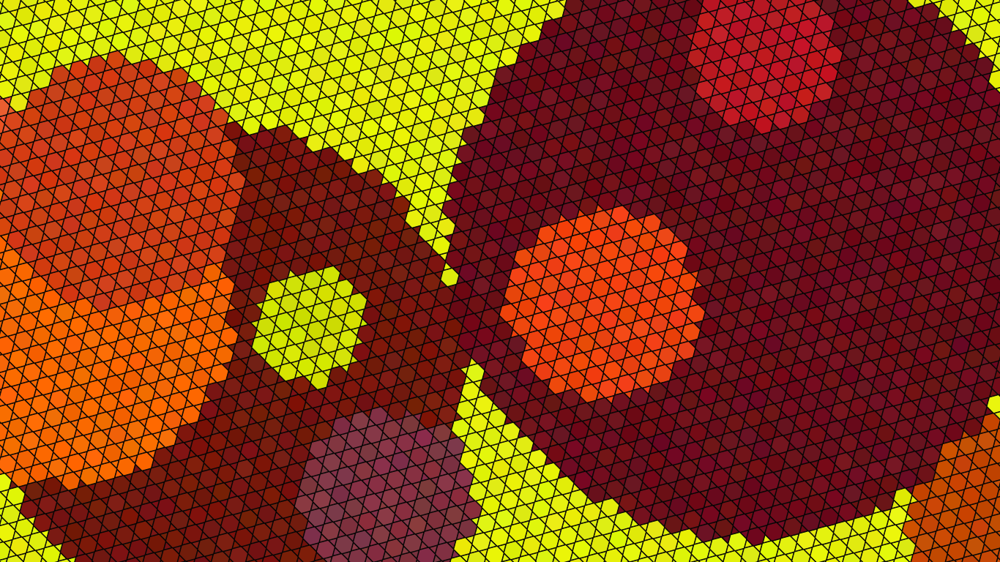
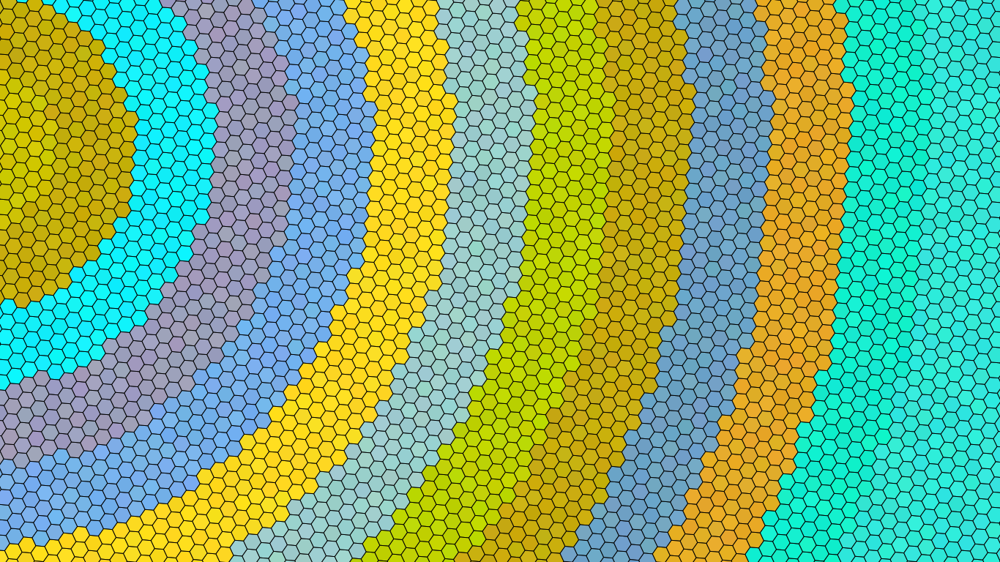

<link rel="shortcut icon" type="image/png" href="profile.ico?">

    <figure>
        
        <figcaption><strong>Rust</strong> (Parallel stripes -- Delaunay)</figcaption>
    </figure>
    <figure>
        
        <figcaption><strong>Ocean</strong> (Parallel waves -- Squares and triangles</figcaption>
    </figure>
    <figure>
        
        <figcaption><strong>Fire</strong> (Free circles -- Hexagons and triangles)</figcaption>
    </figure>
    <figure>
        
        <figcaption><strong>Forest</strong> (Free triangles -- Triangles)</figcaption>
    </figure>
    <figure>
        
        <figcaption><strong>Sky</strong> (Concentric circles -- Hexagons)</figcaption>
    </figure>
    <figure>
        
        <figcaption><strong>Blood</strong> (Crossed stripes -- Hexagons and triangles)</figcaption>
    </figure>
  

<a href="http://www.w3.org/html/logo/" target="_top">All images are generated as SVG</a>

---

    

    
This project is written in pure Rust and aims to provide a cross-platform utility for generating random abstract wallpapers. It is fast and memory-efficient enough to be able to run in the background at regular intervals

 

    

    
The full source code is hosted on GitHub, and so is this website. Contributions in any form (pull requests, feature requests, bug reports, etc...) are welcome.

